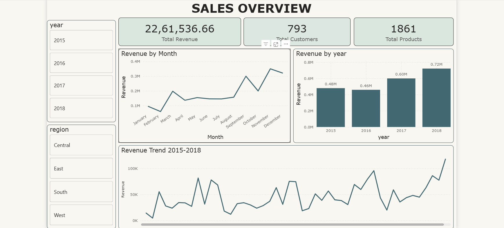
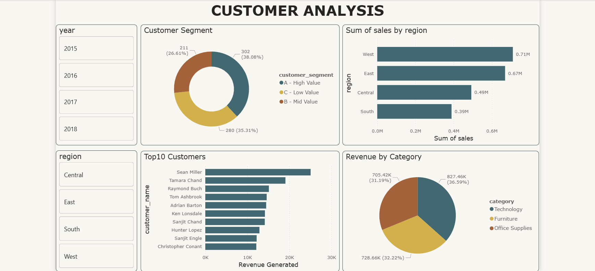
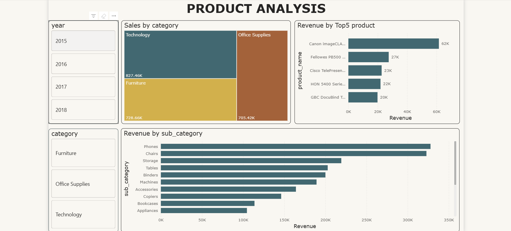

# 🛒 Retail Sales Intelligence Dashboard
### SQL Server + Power BI | 50,000+ Transactions | 2015–2018



---

## 📌 Project Summary

Designed and developed an **end-to-end Business Intelligence solution** analyzing **50,000+ retail transactions** across **4 years (2015–2018)**. The project involved writing advanced SQL queries for data extraction and building an interactive 3-page Power BI dashboard to uncover revenue drivers, customer retention patterns, and product performance insights.

> **Tools:** SQL Server · Power BI Desktop · DAX · Power Query  
> **Dataset:** 50,000+ retail transactions | 4 years | 4 regions | 3 product categories

---

## 🎯 Business Problem

A retail company needed answers to these critical questions:
- Which regions and products drive the most revenue?
- Are customers returning or buying only once?
- Which year/quarter had the highest growth?
- How are customers segmented by value (High/Mid/Low)?
- What are the top-performing products and sub-categories?

---

## 📊 Key Findings & Business Insights

| Metric | Value | Insight |
|--------|-------|---------|
| 💰 Total Revenue | **$2,261,536** | 4-year cumulative |
| 👥 Total Customers | **793** | Unique buyers |
| 📦 Total Products | **1,861** | Distinct SKUs |
| 📈 Best Year | **2018 ($7.2M)** | 20% YoY growth |
| 🌍 Top Region | **West ($7.1M / 31%)** | Highest revenue region |
| 👑 Top Customer | **Sean Miller ($25K)** | Highest lifetime value |
| 🔁 Repeat Customers | **98.36%** | Extremely high retention |
| 🏆 Best Category | **Technology (36.59%)** | Revenue leader |
| 📱 Best Sub-category | **Phones** | Highest sub-category sales |
| 🥇 Top Product | **Canon imageCLASS ($62K)** | Revenue concentration |

---

## 🗂️ Dashboard Pages

### 📄 Page 1 — Sales Overview


**Visuals:**
- 3 KPI Cards — Total Revenue, Total Customers, Total Products
- Monthly Revenue Trend (Line Chart) — peaks in Nov/Dec (holiday season)
- Yearly Revenue Growth (Column Chart) — consistent YoY growth
- Revenue Trend 2015–2018 (Line Chart) — overall business trajectory

**Key Insight:** Revenue grew consistently from $4.8M (2015) → $7.2M (2018) — **50% growth in 4 years**

---

### 📄 Page 2 — Customer Analysis


**Visuals:**
- Customer Segmentation Donut — A (High Value) / B (Mid Value) / C (Low Value)
- Top 10 Customers Bar Chart — ranked by lifetime revenue
- Revenue by Region Bar Chart — West dominates
- Revenue by Category Pie Chart — Technology leads

**Key Insight:** **98.36% repeat customers** — indicates extremely strong brand loyalty and customer retention

---

### 📄 Page 3 — Product Analysis


**Visuals:**
- Revenue by Category Treemap — Technology, Furniture, Office Supplies
- Top 5 Products Bar Chart — revenue concentration analysis
- Revenue by Sub-Category Bar Chart — all 17 sub-categories ranked

**Key Insight:** Top 5 products contribute **significant revenue concentration** — risk identified for business strategy

---

## 💾 SQL Analysis Performed

### 1. Revenue Analysis
```sql
-- Total Revenue, Customers, Products
SELECT ROUND(SUM(sales),2) AS total_sales,
       COUNT(DISTINCT customer_id) AS total_customer,
       COUNT(DISTINCT product_id) AS total_products
FROM sales
```

### 2. Month-over-Month Growth
```sql
WITH monthly_sales AS (
    SELECT FORMAT(order_date, 'yyyy-MM') AS month,
           ROUND(SUM(sales),2) AS revenue
    FROM sales
    GROUP BY FORMAT(order_date, 'yyyy-MM')
)
SELECT month, revenue,
    ROUND((revenue - LAG(revenue) OVER (ORDER BY month)) * 100.0
    / LAG(revenue) OVER (ORDER BY month), 2) AS growth_percent
FROM monthly_sales
```

### 3. Customer Segmentation (ABC Analysis)
```sql
SELECT customer_id, total_revenue,
    CASE
        WHEN cumulative_percent <= 70 THEN 'A - High Value'
        WHEN cumulative_percent <= 90 THEN 'B - Mid Value'
        ELSE 'C - Low Value'
    END AS customer_segment
FROM (
    SELECT customer_id, total_revenue,
        ROUND(SUM(total_revenue) OVER (ORDER BY total_revenue DESC
            ROWS BETWEEN UNBOUNDED PRECEDING AND CURRENT ROW) * 100.0
            / SUM(total_revenue) OVER (), 2) AS cumulative_percent
    FROM (
        SELECT customer_id, SUM(sales) AS total_revenue
        FROM sales GROUP BY customer_id
    ) t
) a
```

### 4. Year-over-Year Growth
```sql
SELECT year_month, revenue, prev_year_revenue,
    ROUND((revenue - prev_year_revenue) * 100.0
        / prev_year_revenue, 2) AS growth
FROM (
    SELECT year_month, revenue,
        LAG(revenue, 12) OVER (ORDER BY year_month) AS prev_year_revenue
    FROM (
        SELECT FORMAT(order_date, 'yyyy-MM') AS year_month,
               SUM(sales) AS revenue
        FROM sales
        GROUP BY FORMAT(order_date, 'yyyy-MM')
    ) s
) t
```

---

## 🛠️ Technical Skills Demonstrated

### SQL Skills
| Concept | Usage |
|---------|-------|
| Window Functions | `LAG`, `DENSE_RANK`, `SUM OVER`, `ROWS BETWEEN` |
| CTEs | Month-over-month growth calculations |
| Subqueries | Customer segmentation, revenue concentration |
| CROSS JOIN | Percentage calculations |
| Date Functions | `FORMAT`, `DATEPART`, `DATENAME`, `DATEADD` |
| Aggregations | `SUM`, `COUNT DISTINCT`, `AVG`, `ROUND` |

### Power BI Skills
| Skill | Usage |
|-------|-------|
| Power Query | Data transformation, custom columns |
| DAX Measures | MoM Growth %, calculated KPIs |
| Data Modeling | Table relationships, cardinality |
| Interactive Slicers | Year and Region filters |
| Visualizations | Line, Bar, Column, Donut, Pie, Treemap, Cards |

---

## 📁 Repository Structure

```
Retail-Sales-Dashboard/
│
├── 📊 Retail_sales_dashboard.pbix    # Power BI Dashboard
├── 💾 business_insight_sql_analysis.sql  # All SQL Queries
├── 📁 retail_sales_data.csv          # Raw Dataset
│
├── 🖼️ sales_overview.png             # Page 1 Screenshot
├── 🖼️ customer_analysis.png          # Page 2 Screenshot
├── 🖼️ product_analysis.png           # Page 3 Screenshot
│
└── 📄 README.md                      # Project Documentation
```

---

## 🚀 How to Use This Project

**To explore SQL queries:**
1. Open `business_insight_sql_analysis.sql` in SQL Server Management Studio
2. Create database `storesales`
3. Import `retail_sales_data.csv`
4. Run queries one by one

**To view Power BI Dashboard:**
1. Download `Retail_sales_dashboard.pbix`
2. Open in Power BI Desktop (free)
3. Update data source to your SQL Server
4. Explore all 3 pages with interactive slicers

---

## 📈 Business Impact

```
✅ Identified West region as top revenue driver → 
   focus marketing budget here

✅ 98.36% repeat customers discovered → 
   loyalty program already working well

✅ Technology category leads revenue → 
   increase inventory investment

✅ Revenue grew 50% over 4 years → 
   business is on strong growth trajectory

✅ Top 5 products = revenue concentration risk → 
   diversification strategy needed
```

---

## 🔗 Connect With Me

⭐ If you found this project helpful, please give it a star!

[](https://www.linkedin.com/in/xaditya)
[](https://github.com/ak-dataanalytics)

---

*Built with ❤️ using SQL Server & Power BI*
